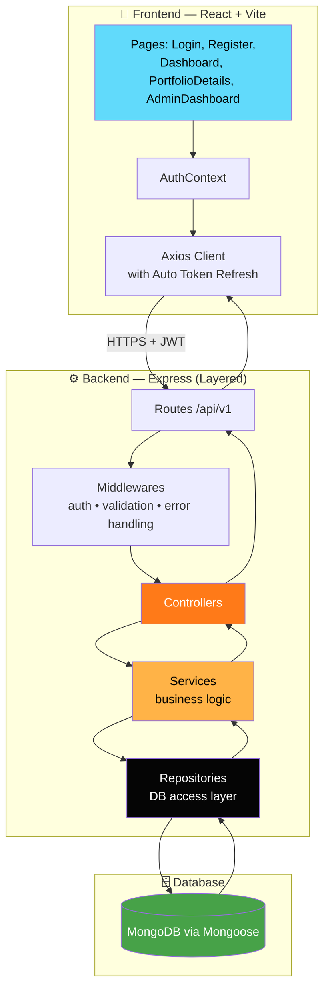
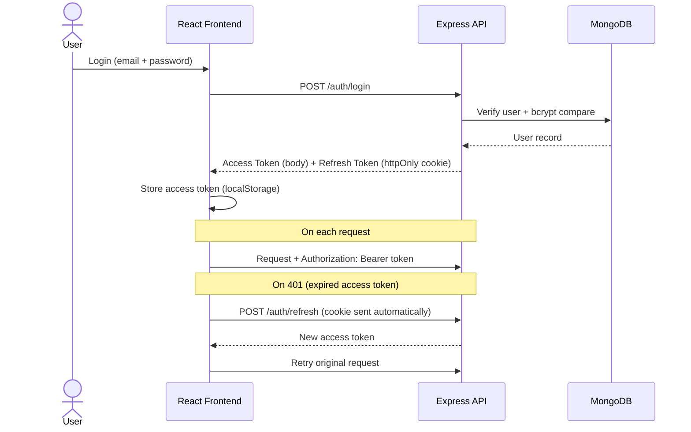

<div align="center">


<br/><br/>


<br/>


<br/><br/>


<br/>


</div>

<br/>

## 📖 Table of Contents

- [Overview](#-overview)
- [Architecture](#️-architecture)
- [Authentication Flow](#-authentication-flow)
- [Features](#-features)
- [Tech Stack](#️-tech-stack)
- [Folder Structure](#-folder-structure)
- [Setup](#-setup)
- [API Overview](#-api-overview)
- [Calculated Fields](#-calculated-fields)
- [Security](#-security)
- [Scalability Notes](#-scalability-notes)
- [Author](#-author)
- [License](#-license)

<br/>

## 🦊 Overview

**AlphaFox** is a full-stack crypto portfolio tracker. Users register, log in, create one or more portfolios, and add crypto holdings (BTC, ETH, and more) — the app then live-calculates total investment, current value, profit/loss, top-performing asset, and portfolio distribution.

Built with a clean layered backend (**controller → service → repository**) and a React + Vite frontend with automatic token refresh, role-based access, and an admin dashboard.

<br/>

## 🏗️ Architecture



**Why layered architecture?** Controllers stay thin (HTTP only), services hold business logic independent of Express, and repositories isolate all DB access — so swapping MongoDB for another store, or adding a caching layer, never touches controller code.

<br/>

## 🔐 Authentication Flow



<br/>

## ✨ Features

| | Feature | Description |
|---|---|---|
| 🔐 | **Auth & Roles** | JWT access + refresh tokens, bcrypt hashing, role-based access (`user` / `admin`) |
| 💼 | **Portfolios** | Create, update, delete, and view multiple portfolios per user |
| 🪙 | **Assets** | Add crypto holdings with pagination, search, sort & filter |
| 📊 | **Live Analytics** | Investment, current value, profit/loss, profit %, top asset, distribution — all derived, never stored |
| 🛡️ | **Admin Dashboard** | View users, delete users, platform-wide stats |
| 📑 | **Swagger Docs** | Full API documentation out of the box |
| ✅ | **Validation** | Joi schemas on every write endpoint |

<br/>

## 🛠️ Tech Stack

**Backend:** Node.js, Express, MongoDB (Mongoose), JWT auth, bcrypt, Joi validation, Swagger
**Frontend:** React (Vite), React Router, Axios (with auto token refresh)

<br/>

## 📂 Folder Structure

```text
portfolio-tracker/
├── backend/
│   └── src/
│       ├── config/       # env, db connection
│       ├── controllers/  # request handlers
│       ├── services/     # business logic
│       ├── repositories/ # DB access layer
│       ├── models/       # Mongoose schemas
│       ├── routes/       # Express routers (v1)
│       ├── middlewares/  # auth, error handling, validation
│       ├── validations/  # Joi schemas
│       ├── utils/        # jwt, response helpers, seed script
│       ├── docs/         # Swagger spec
│       ├── app.js
│       └── server.js
└── frontend/
    └── src/
        ├── pages/         # Login, Register, Dashboard, PortfolioDetails, AdminDashboard
        ├── components/    # Navbar, Alert, ProtectedRoute
        ├── context/       # AuthContext
        └── api/           # axios client with auto token refresh
```

<br/>

## ⚙️ Setup

### 1. Backend

```bash
cd backend
cp .env.example .env    # edit MONGO_URI / JWT secrets as needed
npm install
npm run dev              # starts on http://localhost:5000
```

- Swagger docs: `http://localhost:8000/api-docs` *(for reference — mainly test via Postman)*
- Health check: `http://localhost:8000/health`

**Seeded accounts** (after `npm run seed`):

| Role | Email | Password |
|---|---|---|
| Admin | admin@example.com | admin123 |
| User | pranav@example.com | password123 |

**Custom MongoDB data directory:**

```bash
mongod --dbpath "E:\cryptoport\mongodb-data"
```

### 2. Frontend

```bash
cd frontend
cp .env    # points to backend API URL
npm install
npm run dev              # starts on http://localhost:5173
```

<br/>

## 🔍 API Overview (`/api/v1`)

**Auth**
```text
POST   /auth/register
POST   /auth/login
POST   /auth/refresh
POST   /auth/logout
GET    /auth/me
```

**Portfolios**
```text
POST   /portfolios
GET    /portfolios?page=&limit=
GET    /portfolios/:id
PUT    /portfolios/:id
DELETE /portfolios/:id
GET    /portfolios/:id/summary        -> totalInvestment, currentValue, profit, profitPercentage
GET    /portfolios/:id/top-asset
GET    /portfolios/:id/distribution
```

**Assets** *(supports pagination, search, sort, filter)*
```text
POST   /assets
GET    /assets?page=&limit=&search=&sort=-profit&symbol=BTC&portfolioId=...
GET    /assets/:id
PUT    /assets/:id
DELETE /assets/:id
```

**Admin** *(role = admin only)*
```text
GET    /admin/users?page=&limit=
DELETE /admin/users/:id
GET    /admin/stats
```

<br/>

## 🧮 Calculated Fields

> Never stored — always derived at request time.

```text
investment       = quantity * buyPrice
currentValue     = quantity * currentPrice
profit           = currentValue - investment
profitPercentage = (profit / investment) * 100
```

<br/>

## 🛡️ Security

- Password hashing with **bcrypt** (10 salt rounds)
- **JWT** access + refresh token rotation, refresh token in an **httpOnly** cookie
- Input validation with **Joi** on every write endpoint
- `helmet`, `cors` (restricted to client origin), `express-mongo-sanitize`, `xss-clean`
- Rate limiting (`express-rate-limit`) on all `/api` routes
- Centralized error handler — never leaks stack traces in production

<br/>

## 📈 Scalability Notes

> Not implemented yet by design — noted here for when this moves toward production scale.

- **Layered architecture** (controller → service → repository) keeps business logic independent of Express and the DB driver, making it easy to swap MongoDB or add a caching layer without touching controllers
- **Horizontal scaling**: the API is stateless (JWT-based, no server-side sessions) — deployable as multiple instances behind a load balancer with no sticky sessions required
- **Caching**: hot-path reads like `/portfolios/:id/summary` and `/distribution` are good Redis candidates (short TTL, invalidated on asset write)
- **Database**: indexes already exist on `owner`, `portfolioId`, and a text index on `coinName`/`symbol`; heavier scale could move to a sharded MongoDB cluster keyed on `owner`
- **Microservices path**: Auth, Portfolio, and Asset domains are already separated into their own services/routes — splittable into independent deployable services behind an API gateway if traffic demands it
- **Deployment**: backend is easily containerized (Dockerfile + docker-compose with a Mongo service); frontend builds to static assets (`npm run build`) servable via CDN

<br/>

## 👨‍💻 Author

<div align="center">

### **Pranav Amrutkar**

Full Stack Developer • Building Production-Grade Web Apps


</div>

<br/>

## 📜 License

This project is licensed under the **MIT License**.

<br/>

<div align="center">

### ⭐ If you found this project useful, please consider giving it a star!


</div>
