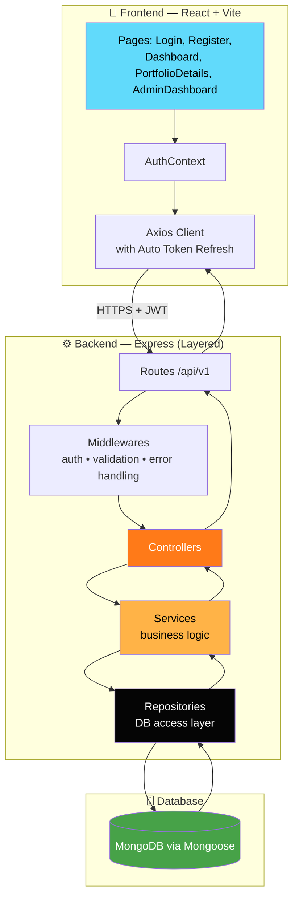
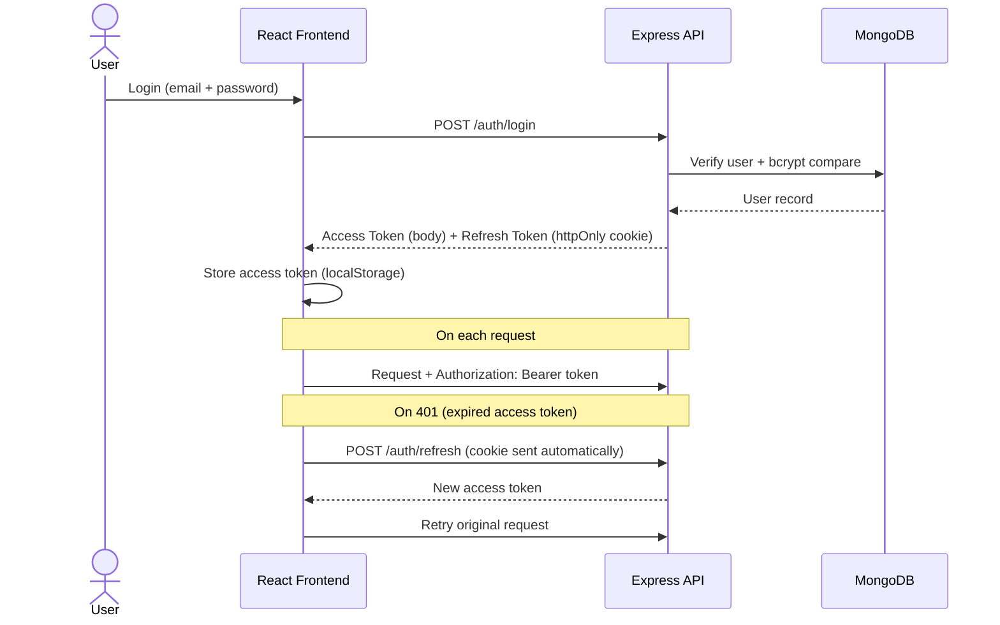

<div align="center">

<img src="data:image/png;base64,iVBORw0KGgoAAAANSUhEUgAAA4QAAAF/CAMAAAAmWvf6AAAB/lBMVEUFBgn9/P30eA/uZxfnVxf4hBDp6OnydyEmJijuaiEYFhbkSxKVlZYvFgtTJw7ZRxOpqar6gyONSA+GhodVVVa4uLiwVhTY2NlxNg/QZxLPVxh2dndsKg+RNxM1NTbHx8dHSEmtSBX+kQ9lZWbYdA1JGwwlDgiaUw3PPA345djx2s6vOhH3ybEdHiBaMQ3nXCG4YxHvhlHxmnDyqYU5IQ18QwvztpTQaCGPLA1eXmC8vsDue0bypHv0vaQ+PkHYcyLe3uDhPQT30ryuWCbCXiDg3+AgHiCenqC/wL//kCMfICA/QUJfYGFkHQlnWFV+foCMWE6yYiCgn5/Th3FAPkB1RDpgX2GJOiWRgXqfoKGxYEmzjYOgn6C/wMDHclrNc2LKno/f4N/zk1rlzs4AAAAAAAAAAAAAAAAAAAAAAAAAAAAAAAAAAAAAAAAAAAAAAAAAAAAAAAAAAAAAAAAAAAAAAAAAAAAAAAAAAAAAAAAAAAAAAAAAAAAAAAAAAAAAAAAAAAAAAAAAAAAAAAAAAAAAAAAAAAAAAAAAAAAAAAAAAAAAAAAAAAAAAAAAAAAAAAAAAAAAAAAAAAAAAAAAAAAAAAAAAAAAAAAAAAAAAAAAAAAAAAAAAAAAAAAAAAAAAAAAAAAAAAAAAAAAAAAAAAAAAAAAAAAAAAAAAAAAAAB90PNbAAAAgHRSTlP/////////////////////////////////////////////////////////////////////////////////////////////////////////////////////////////////////AAAAAAAAAAAAAAAAAAAAAAAAAAAAAAAAAAAAABWU8B4AABwZSURBVHja7Z0He+LIlkCNyEGAARNNaoy7bXdOk2d2Zva9fTluzuH//4eVEEgqqVQqgWSg+5xvQrfBIulwb91bVbq4AAAAAAAAAAAAAAAAAAAAAAAAAAAAAAAAAAAAAAAAAAAAAAAAAAAAAAAAAAAAAAAAAAAAAAAAAAAAAAAAAAAAAAAAAAAAAAAAAAAAAAAAAAAAAAAAAAAAAAAAAAAAAAAAAAAAAAAAAAAAAAAAAAAAAAAAAAAAAAAAAAAAAAAAAAAAAAAAAAAAAAAAAAAAAAAAAAAAAAAAAAAAAAAAAAAAAAAAAAAAAAAAAAAAAAAAAAAAAAAAAAAAAAAAAAAAAAAAAAAAAAAAADhPhjXeA4CjYnR4DwCOSbNYbPIuAByRp8XiDe8CwBG5KRpFElKA4/G+aBjFoskbAXAsOlYgLBZHvBEAx2JUtHnylHcC4FjZqMMTKqQAx+HDk62FVEgBjsPrzZDQhgopwDGoGZvi6AYSUoAj0Cx6kJACHIGnPgn1K6RD3jiAtBgV/WgmpB1iJkBavBcc1ExIPzxBQoC0cBsUW3QS0uETJATIKBvVatkPKeEApIdZDHITt8q+SR0VIEVehiSMS0hNmhkAafI0LKG6QmreOBNs2JUGIJshoY2huH9t6yDLDwHS4b07Za1veBb2VdJu74eEAKnwYRf8iubwiUaF9LV7JyQESDMbNYwbe6eZ2JZ9xxMVCQHSwHQDYV+cyS1f1OQLlkgIkAovBetex1RIm8WikXSSKQAo8RoULzdx0VAmpCPDZjtsfMm7B5ACN2J2+dSzULKoqW8YnoVICJAG73fSbedjC3PYgpZd5/0SFj/w9gEcTicY93zVz2BC2iwUDB/sRwOQBt50md1CeSOqQmq2CoW8X0J2KQU4HDPccPA1IQyhAPpQr9cdC4uOhH3eP4CD8YzzUs/X8lX21/XWxkI3GLJrPkAKPJVMFvW3KZ70vWTUwbOQtUwAKeA2KJ50/Ga6BVBvDulD3bXQHRUyZQYgxSFhU/pTd1HTdf3ZVsKWJ+GadxDg0CGhfCKov02xzVNvnznYodCVkHlrAIfSd1UbRQRIt0L6+x93EnqhkO1/AVIbEgbaDV4o9Iqgz+r17bDQCoW2h3mDbj3AgfhWLg2DdjrNwKI3M8ZcXz9sRSzkNyAhwKF8iFwbOCz6J4m6Yz9z/eUzW8OthUveQoDDeB29bGnkt1AYMFoetlrjjYRj3kKAbIaEm0zVWzBhBJLV2+uHVsECCQHSGxKGR3e7UOiIGGxGrJd5W0O69QAHMYysy9iG+h208tX+h6aw2e91wdKQbj3AQfSV+8kIq+iddsXrji/0mQ+F/DVvIsAheGsJZbNAzY2ARmBn7pHPw3XrS95EgAOo3ag3GXW2mzF2G3TvAqMxGroeMiYEOARTvbGaM3nNCGP9sM+sUYA0JIy7ClMnwkJb3jEaAhyMf7vtoXYo9FqLaAiQooTynSr6xQgBNxO7i32GhAAH8dJX+pQvkjdDCoo/YAY3wEEM/f0H+dLATlGUMJiaPrkhJwXYn45fwoid0278NdFgIFRcvAkANHgqjPCaUdEyCldfRoYAe/La2b2iuFm6G1xHYTabw+Gws4x10PrlR0tJV42uQE33FyfCr/Uye4K9PZ/fI2I2hx86SXnKtX8yYlQUSi3+gGYu80axqGgTurdsyqSPlJLWSjmR3n6/+KvMnmFDfH6VU/vIXz4dWR/Xkw1eHvQkTDFwK5utZyqhOx3NK80M+0YMgp6y5YiZMBFP8VKurSvhQPjFq8yeYfeUJTSfBiYCJ4DLjmQrYVHc1L7ZMYpGIraX2s6eeS6I5lkeiISfp4Sd4pMiEp6qhDsR7Xy0+bqor6B/2e8jWLgIOZjrnpiEp5uOmjcHKIiEGUpoCBZOL8y+sS+PcHWYdljC/6khoZ6DRvEgGBNm9d3oK7HY/446xgFk3qqo5CRMkFDTQQMJT4/hjZEm1od8k62FXZmEAyRMOvIgHT0dBYtG2mQbC2t/I5NQr0vxuUvYeYKEJ0dzVCwaWViY4XNeSR3UE+ozl9AsFpHw1AaDfWclUgYWZniFmLlcwtwMCWMDIRKeGkIfsJjywDCzZ72IcDDXQMI4bg5V0EDCdDPRmwwioEdmE9jaURKWKkgY85EXkfCkeJqpgtldQXuWi2SChJlno0iYahg0Mqb/KGe30KWoIaGS15LI5t+lJCr8eeOVG1aNnk8YzOwS2pVStIS5FRImHRLedJqmWUsA8qTDe2f2YNYSZtKmmCgczM2RUIWkQUFcOxLDYKKRjKU57PRHGp2NLNoUgaVIiRv2n7WE4brMEBuOlooeZuHm29N876j4yLWZldLBeKk+awlfitNGqXQeLSUZBT6JxOSNsTswqJkvFVExg2RnrpYwtmH/mUdCsfhisCfQcRwUJ9HvO9oTP72a2YwIi2l/yosYB2OXFWpImE6NIiDhbP9KR3oFE+eay7H76u03TnCfAvWb+FGBcbCCNrLLETazb1NcxUlYqh0qYbd0X9JjMG83VrOaloSKo1iH6faiI+UvB3pPZvB1e7KoxUdCw720Vjqrkszmh/5oZC/EKftwPn7rDz/88MWfOy/NUD42GuUt3N+5VD+XpnjQ8g+X51tRGsr6P7pJ6OZNy+/+PpUcflrUknV/Qo369iRhwz5ewkYuGYPGQkPC2C+Pq1WEQMqeTOgw7YWGhOntgVAb/rl86R7zckfREabs/qDcH8qCsvcbl8oakVm+LAv3vvzhbB0MrGPR9k9g+yNpkOsXs21ThM7sRWjbtcFjS2h3RnppHKYk3xfxl6Vkh7mKHhY3L4XP5vJgCYe2ZrsI5YuFXoDb3G7/vzgSLRtaP7/cWuocQdFWHl16x7fvXfzhbEezT5PFwY1w+UgM2ZrBUaZTSEPGzSUn++rxJbQiciWNw5RWKUioSAYsCYspSrgeXYrJp7Gxz5Nxa6AbeIUTpvPrnYHluAKC/7vdOfIZO2hoW5iXhMBwQGxK6j5ZzpuZSISrJGvYZyRhrrRI5TDdA9PR7VeCZiQ87AtyuDXPKDsCbn0rezFLiJJGcG/ofuD24igiIe9cBk6py+Yn42CkhvbQL680cJeVDiXFGffG9BPSgWyuaKhWsziGhKGH3fMw3TQkjFrUlaqEQ//BxHqMv0jjv8/lpXDCvL4Ubixfvo54IO8w5azXqmY8HiwaoSm66sGfBpJks2Pkg8PCtN6znjTv6unGgYwlDCyk2vcwkzQkjMjJ05Sw6YtiZb+EQhnTCGgmxrCRX1grLEqfUNNLaZ3/n+9Uu45vlry0t57fC6N/G0rgw5ntKJ0aabBRX3oh/bGyMZ6dhIE8eO/DLNKQUL600pNwk0QeMiYUxh3+iLcty4TzK8c0IeU0xaBp3TyUFEZ9cdD+4+XZbvc2jGnR5/fFGF+vTcWwcJu6jlPQcBGRdPWSNOwzlNB63FoKhxnEVaP2T0hdCR1RDjmd+1GJaKhVKLQPA8GuWRYctP7SVJX6HI0/CQeNFB10GI+XneF103QfLOCgreHhSelV1BS1QYKGfZYSCuFn/8MEUsmIveX2CYVNYYR2iIQvt41AyeBPsLAc6OEHC5vDSzGPDdU9xdGN9ZzPdqpd01vBqdEI3J/RuDO0VFwGDr2ttuanB71/s8ixX5KGfZYSCiG4m0spFO4nofQ9aJbT6hOOAg3BoGlRWB51ApVP8QCBQDcs5wMp7bk6aBaLl5cZBcFQzdSKi0t3gk1+W2V1L2x/wFvYjpyrHRo1KVbYa0xb219Cfwg+4DDiqPD9XumodFZsUxysXS73/lYPz1AzyrvOeygiincNpJP9y8A9+0LADQ4sz7Y5cXOZWSKqJ6Z/MeK+72JFUQQNBa+v0ouEX19ZtHdcuQxiljMGDuM/yOY4zv/mpdg2Ra0h/KaMq/lAaxJts+wr9Nsfxt5lvq1QQk9i1O///HPfz+svypchWYON4y8uhXv4K+7vxR6HkS+fbXPi9WOFwR0FG6mCmznd+2nYVcSLmX7DPrGEkaXWymquKodoHuZF72qP/QHCL2sRShS+V0i4yf+CmWHCbDT4qUqzD3O4nVXjK5YHHrW2s9BtUrtFvC/EQmveONvmxIdfRzfmM5Rwo6Hs8QxjPEyelYZGRnOtmk2chL+Kk1C5jeJEoY/+esJeaY+tG+O/pVaxY0LLnGR4BfCAhPmmOmqWVStrTNFBi/WuApv3DweN83WwGbHFdj5TAcMaigPHxFnpSplxLrQb9gEJ5wdJePG76BwwwaLeRaI5P7rV40m8hIZuQWU72nOPY+SFImjVVA8gtxmRfFB4cbEuB6vp5rYw6qZSodHimQ0IZTXRQ9TSVnB777CDm58lDIdzde1Fu2GfqoS10Gh0toeEtVBEXe31Sa9iu6WehHnPC32qbs3SENYCxq1X6zhrAdy7m3JNd6eHdZcv3AfZfW1vf3iePPUc9A3RkmeW1WrV+SDcH+oouAuH8jpqgnDYi6nAf6XbsE81HbWGdKWoykyS7S2C/fjuXh91RUNCf2YSUjDOyYCEroVx7XMzLz7YOtzHNgQHy+WfRTHzeevRz3blRHOXiW6XRYz7neFU00TboOo3b7/9+NP93Z17mtzd3f30/OPbN+V8QMVCNJFV05Fuz+IqrvY3kE9pO7gwEzc+a0d9NyTaY6aR/KIah0poqONg8Ea7NDkSQpuN88U8jXtm7uDOOVYzIljudLNZ2ocWLDzb5oTdndguDDRG/eFmTstwpBUC89U33z6/V/So7u6fv/tfKzJuHSuokYbCzdfCtYaHs9hAp9uwT1vCr6KeVyIJv0owBf0wCX3uOKoZWknp5hxyJewLgsTr0Sm77WL7YEO5pzux7ZzL+ccXKM63OWEvnHRO9f5uBHb9haGRg+bfvPtJr0d89/zdm3JBh+jHi09LG7H1w5pmwz5tCRdRMSyRhIvHl9BdreZO6N50LSRGumVtQUKfheu4ZzYs58u+bFPq01i9enV6tg6+3+Sio+VuVueF2S/HxD87or35eJdsdsb9x7dOdrpPVrr1UBUPQ1NiGvGeRlQ30pZwloqEszQkrOlLWM1XveTPKHsrH7Z/CCSim/v50tF+uep+clWNwZr1uGV3BlVVLqFZ3VYc5OfH2Tp4YV8C1N8bHxrl2CBYfXu/35QtKyRWlaGwrvTwOkmjfqaRsc4fRcLA98OeEgaOIpewMlv0VKySSOimeU7oy1d3o5ZQGPRsze+Os/SljlWvXqOS0MssIyTcTIWLkvB8mxMXzeLI3we4XaozUWt4l3/zPHcIP717k6/X6yoPI77pVN+moa3vrzRKJBHdtjOVsLJqzxN+FnIJqztciZy/Of8pV0PJqK8EI5ewGi/h2j1KVTG8G5arYQk3mo/O18GLjvBqm6OsgmAgIn77Tb4QKWJd5uHSTNao72m1vNufjISLqz0+CKWEgkQ+I51WRLUacND5iSdhVfj12BPRLG8F3DxUZI1lWpYpWD3j5kToFcZ0I+qFt3e5lLBEtFJTmYj1uhMo/Y89jRvYD/TmVn6t07A/QwkrV3t9CBESOjnPLvdxDKz6g2IkXkBalqu+GDrSlXDre3Shs5OXRcIzbk5EloCl/cA0FdyevVZqWt05JzgoaFiIX2T4j1qBUNLQb3wSEvb2W8qkGhOGw2C8gvbabYmEeS0J3VBr/0fRbejLRkmfypWjzJGhnBJT/+Y+lwX3HzcRUTCxvstKLRHHOs36ue72vgONidBnJ+Fi3/deJmE1MNjyxnwxc2WcDRR81VFPTT0Jq17sVbX8xuEzdPqJONisqgysFqrf5bLjzp5f803VC4M//vij9d9X37x9fvcHjSe/0F43r9OwPzcJK6VMJNwOtr4YjceblX/jHe5f/tZiLPy4vxQl3IqlHwmdRFgp4TJ0plY/kWS0qZ5tXX9bymXP3f3z7z6+e/fu22/fvfv4cTcXZxH/7NvaO8iE1v1KGvbnJmE7l00k3Ei4b/dtWfXXMeMlXPvVUkk4zAcKpPbT/CTKMtfK9Q71V9/ljkcp7nqC4f6fYmLl38WPHs9MwkUul2E6ur+EwrmUTEJFYSacsdnPcvwJWDhULjmqf3OXOyaDuAWsDe31uloN+zOTsJ2uhIHTYN9FskvxZEqQjiorLeZY0r6yQuPyE3Aw1AL1lyvfHlXBXCluxUBoTKS8tm78lvjnJWGtdAYSjtOScJwPSehMd5x+cnFQ6Nt9d2wH2zEX9fxjolXn8Vvin5eEM9l7VirJfhb6qVTCwilIeB111ELEqZo/7y7FtdLBV/f721NSXX1W6xD2/eJWztU0G/VRXYpQ8npeEoa/VHqzShSLUkIJq9O9JSzsn44WIiScKk7V6vUZOxj86hPD4L4OlnSJOYTGPg49vbURO8PCXYpG1hLmspRwojdNQfrSNCLhwRJuptwUbhMVZgryufrDqm8NjnUn/+qbsy6RNlVhsF69y1bBCDG9Pw3iGxRzvVWCLi/idi47zaVMURJ2k2x7UdGTsLBzoZBPIRJq9RCa4mLVa3m4CC99c/dWeaWR854opmo0WH9195juSaLkv7y4iFEqQaM+spjazVbCXior66MkbGgXhsNfQN3YM31vCTt5b96hJWH8ol5fGLR+UdJ+N8VVp9XwCXuuJdKxysHC/cEO3pciiwTxCl4tNF5BW2MiWkyXItDbT1vCblS2nIGEJfV3Vu3RJJwKx4mf3LncRuDtw0qkHfsc3MzmmY6DofHhLB1cuhXfQiG44r1efy6ZXvbX/3quZ+Bgm1gO5l+3G93JZPWVvah00rA3ZN94ad/+i1+UItTNla56Oq8gSaM+skuxUp2p80MlnEcN2j4fCeOD1Fh82LCEy0JAwqk/NhbOt1ExVG04Uf9O9O/tf/78T79f/+n/NBQcbAwszduT3uw3klOhMutZNm5kjBgUzhvf672EJI36yFLOXHWmSs7rRBL2Ip/gpyzhdVUonBRi8tFhYKRnStPb4BNbiz979eoMS6RN/5aEIQffeQJ+99d/na7tAtfsa81E1PJvEZsXWi52/7IJjF7KaofO9uT7muZLUDbqa5UXte2BarWaopYjdhaD7e/FQRIGn6Fvo8XHHxMmlrCwr4TrwCmlrpoEYlq1JSmMFiSh9Tp02q7PzEHTv7lS4LW8qr/ZLTX67z9d30aUw0MC/sK2adCezGr6T8OKi4vfTboNm+6kt0h0lYWuaipo1wrJO0pt3w2hdfhXqk7ifxwi4UzRxcxCwhSqo6lIeBs4n6otU1kaFcNcMHttBl3bOd2x+x/CDWfWqFh6m2cHltTaX0abj+v+3/7Be1G1ttrBTRI6b/Qqj/cSQo16f38i8LXve1rhi2rOVGPGq4pawuhvnEr4EoSNbCU8uE9YSEdC/xjOOckid481p6F4Fsgq16GxknuofvB3W2fl4HW+ELG3hGVh67l1crX/4H/bKvN4A7uL2qO+hlW4P1GLulF5jVyhnBNaaVG66k4mk9XK0SR0eQn7RgndhmzjpV7KEoayk6uJf3+1hU2S3dbSknAqOb2W0+sQ06XkNBR1NcfRSedt8Lb8OZVIzUKEgy2LH9/m5hPxpJiVYkaCloGP/iLmqmbDPDpIhpYVCinlJKoJs4qqBiXo49RSlnB1wLzcLCVcy/eVDWyIId/qa6kOqkKgDJ7Hr86pRLrMRzpYrz/7598G7r6IDoN2kXPQeOQYKC9zdlXPuKfqUih/M3iEA65z3bhIWcLZiUp40SrsjZiNTgt11XNqxvz66SejwrrBjYPWP5K9zVZRCto1j9LVqnaUFxFSyX8et1XVl54qQtUG2Uk4S1vCyCd7bAmv93ZwfCs6KOj8KtRzvC6Mx+OzLJGOAw7WNxLaCn4pGT9PIhW0/u3OjvQalNuIztQCzFWjyUaMhPuno+2LtCU8JDfOVML9Q+FU6XK48hLQ1LrLeZRIt8NmoSy6yUOloXwSPRI8VhCUxrpF9BkeTAVXqs1mKllJKHYz0pFwdqoSrvd0sKVZGFUMGs+iRGqGR4PRCgq5mzixpb044ouoqCa+yBac+xUI395TVU9TkrB3kb6EB4TCbCUMD+b08CeTt2OtbnwgEo4L51Cc2VVl3M0+x5aCDxE7x/nqov6pobnSv39/1BfRVU0BlRYNJ6rfvlKVXf0O1fY+7f94kYWEtdKJSnixTB4F62JZpSVkmvVWRNFFCCr11rh1BsWZZj7Qmrf+ba3j+wD+ruCgMTvui1BfbnAe1x8Ip5z+qF4ZZCBhcJHVSW7+u4te23NjmsqXvbaDgdLmg22l/+aop9MUd28fj0/fwrG447zdnI9+zo1cKVyOGXQrx34RK9U53lM3+qQjSqFo8mKetoSl3kVGEl4sSulHQqdWfmheN/Xvqa5j4Vr22+5BHhQP1NqMqLyd3E+8RLptT2za8k5f8EuNEqR/NNioHP9VKBv1ERdImSs9raiz3cPGhO1KXD59yAVhvk5Zwu2X88ESXqxbm4JDvR57XUq7+zAN9h706y0Pzpm8e6BxoXV72oHQucZSy6FeV11wxW1D+coxf5mdwItYqGqffx912vlTzkHMOTlrlNKSUJ67p3lptNU8HQnXGyF245R6ChWO9UNMr2IXvlqB83Dti5+b51Iw1QNQX+pqn9cnPX/NGRG6Dj4o4/ZEcNDuC7ZnJ/Eq2sFmyUx144628NIC28GFdqep9BpXg+0yK/vrRyVhKWIPAXtlVsRsoob4BOIkFArT4bXLs4m9QlNSQ4ucaijbCWRdaO2o23qkUmZsTpctp58+to4bLHjaj/UwDU3vvnWexdj5JTtYqBNMs+VYOB7vXsCXp1wa9TlYb6kHsLtA6DqoteXEozQogihvlN2rNpspDuHey3d7TS7hYibfZND+8QtFG/VF/KNHvib5Ya0nG73fYRjZQUyLWxvTIb22WDTRv+Q8Def53Oo9wq3H6Tq43jloZ+oPMW/yJlrk3NWCg8kFJFzNDhAewbpxsF6Pq+NagdCXMcmKC0iYK/2GdwSSZQVeYfQhNtdYuano4C437/HuSSV8wTsCibBnjToLljTamVdbCe8GpVKXrCtCQvIDSERtnH+1mSj6TGPIXdkNCAel+YL3DgkhFexGvR0GtUrPK3c4SBhEQkiLZUE3Fb2wN1vRviIEEgLoYRZ0U1E7dR2U7geD+9gLBCIhQIJstNB6pj2fZ+ZMkaE3iISQajbaqmvP5pnkLAfn3/OuISGkmo3qO3jRzg1KpKJICClno/UEix3nOVJRJITUs9EESx1rpRJzZHQkZMYM6HObaC+4xWDGW6YjIRk7JBgSJlqY8lscREIAJAQAqYQlxoQApxMJc1RHAR6b2WrDV9ur/pGOAgAAAAAAAAAAAAAAAAAAAAAAAAAAAAAAAAAAAAAAAAAAAAAAAAAAAAAAAAAAAAAAAAAAAAAAAAAAAAAAAAAAAAAAAAAAAAAAAAAAAAAAAAAAAAAAAAAAAAAAAAAAAAAAAAAAAAAAAAAAAAAAAAAAAAAAAAAAAAAAAAAAAAAAAAAAAAAAAAAAAAAAAAAAAAAAAAAAAAAAAAAAAAAAAAAAAAAAAAAAAAAAAAAAAAAAAAAAAAAAAAAAAAAAAAAAAAAAAAAAAAAAAHy+/D8SUnE/tarebgAAAABJRU5ErkJggg==" width="480"/>

<br/><br/>


<br/>


<br/><br/>


<br/>


</div>

<br/>

## 📖 Table of Contents

- [Overview](#-overview)
- [Architecture](#️-architecture)
- [Authentication Flow](#-authentication-flow)
- [Features](#-features)
- [Tech Stack](#️-tech-stack)
- [Folder Structure](#-folder-structure)
- [Setup](#-setup)
- [API Overview](#-api-overview)
- [Calculated Fields](#-calculated-fields)
- [Security](#-security)
- [Scalability Notes](#-scalability-notes)
- [Author](#-author)
- [License](#-license)

<br/>

## 🦊 Overview

**AlphaFox** is a full-stack crypto portfolio tracker. Users register, log in, create one or more portfolios, and add crypto holdings (BTC, ETH, and more) — the app then live-calculates total investment, current value, profit/loss, top-performing asset, and portfolio distribution.

Built with a clean layered backend (**controller → service → repository**) and a React + Vite frontend with automatic token refresh, role-based access, and an admin dashboard.

<br/>

## 🏗️ Architecture



**Why layered architecture?** Controllers stay thin (HTTP only), services hold business logic independent of Express, and repositories isolate all DB access — so swapping MongoDB for another store, or adding a caching layer, never touches controller code.

<br/>

## 🔐 Authentication Flow



<br/>

## ✨ Features

| | Feature | Description |
|---|---|---|
| 🔐 | **Auth & Roles** | JWT access + refresh tokens, bcrypt hashing, role-based access (`user` / `admin`) |
| 💼 | **Portfolios** | Create, update, delete, and view multiple portfolios per user |
| 🪙 | **Assets** | Add crypto holdings with pagination, search, sort & filter |
| 📊 | **Live Analytics** | Investment, current value, profit/loss, profit %, top asset, distribution — all derived, never stored |
| 🛡️ | **Admin Dashboard** | View users, delete users, platform-wide stats |
| 📑 | **Swagger Docs** | Full API documentation out of the box |
| ✅ | **Validation** | Joi schemas on every write endpoint |

<br/>

## 🛠️ Tech Stack

**Backend:** Node.js, Express, MongoDB (Mongoose), JWT auth, bcrypt, Joi validation, Swagger
**Frontend:** React (Vite), React Router, Axios (with auto token refresh)

<br/>

## 📂 Folder Structure

```text
portfolio-tracker/
├── backend/
│   └── src/
│       ├── config/       # env, db connection
│       ├── controllers/  # request handlers
│       ├── services/     # business logic
│       ├── repositories/ # DB access layer
│       ├── models/       # Mongoose schemas
│       ├── routes/       # Express routers (v1)
│       ├── middlewares/  # auth, error handling, validation
│       ├── validations/  # Joi schemas
│       ├── utils/        # jwt, response helpers, seed script
│       ├── docs/         # Swagger spec
│       ├── app.js
│       └── server.js
└── frontend/
    └── src/
        ├── pages/         # Login, Register, Dashboard, PortfolioDetails, AdminDashboard
        ├── components/    # Navbar, Alert, ProtectedRoute
        ├── context/       # AuthContext
        └── api/           # axios client with auto token refresh
```

<br/>

## ⚙️ Setup

### 1. Backend

```bash
cd backend
cp .env.example .env    # edit MONGO_URI / JWT secrets as needed
npm install
npm run dev              # starts on http://localhost:5000
```

- Swagger docs: `http://localhost:8000/api-docs` *(for reference — mainly test via Postman)*
- Health check: `http://localhost:8000/health`

**Seeded accounts** (after `npm run seed`):

| Role | Email | Password |
|---|---|---|
| Admin | admin@example.com | admin123 |
| User | pranav@example.com | password123 |

**Custom MongoDB data directory:**

```bash
mongod --dbpath "E:\cryptoport\mongodb-data"
```

### 2. Frontend

```bash
cd frontend
cp .env    # points to backend API URL
npm install
npm run dev              # starts on http://localhost:5173
```

<br/>

## 🔍 API Overview (`/api/v1`)

**Auth**
```text
POST   /auth/register
POST   /auth/login
POST   /auth/refresh
POST   /auth/logout
GET    /auth/me
```

**Portfolios**
```text
POST   /portfolios
GET    /portfolios?page=&limit=
GET    /portfolios/:id
PUT    /portfolios/:id
DELETE /portfolios/:id
GET    /portfolios/:id/summary        -> totalInvestment, currentValue, profit, profitPercentage
GET    /portfolios/:id/top-asset
GET    /portfolios/:id/distribution
```

**Assets** *(supports pagination, search, sort, filter)*
```text
POST   /assets
GET    /assets?page=&limit=&search=&sort=-profit&symbol=BTC&portfolioId=...
GET    /assets/:id
PUT    /assets/:id
DELETE /assets/:id
```

**Admin** *(role = admin only)*
```text
GET    /admin/users?page=&limit=
DELETE /admin/users/:id
GET    /admin/stats
```

<br/>

## 🧮 Calculated Fields

> Never stored — always derived at request time.

```text
investment       = quantity * buyPrice
currentValue     = quantity * currentPrice
profit           = currentValue - investment
profitPercentage = (profit / investment) * 100
```

<br/>

## 🛡️ Security

- Password hashing with **bcrypt** (10 salt rounds)
- **JWT** access + refresh token rotation, refresh token in an **httpOnly** cookie
- Input validation with **Joi** on every write endpoint
- `helmet`, `cors` (restricted to client origin), `express-mongo-sanitize`, `xss-clean`
- Rate limiting (`express-rate-limit`) on all `/api` routes
- Centralized error handler — never leaks stack traces in production

<br/>

## 📈 Scalability Notes

> Not implemented yet by design — noted here for when this moves toward production scale.

- **Layered architecture** (controller → service → repository) keeps business logic independent of Express and the DB driver, making it easy to swap MongoDB or add a caching layer without touching controllers
- **Horizontal scaling**: the API is stateless (JWT-based, no server-side sessions) — deployable as multiple instances behind a load balancer with no sticky sessions required
- **Caching**: hot-path reads like `/portfolios/:id/summary` and `/distribution` are good Redis candidates (short TTL, invalidated on asset write)
- **Database**: indexes already exist on `owner`, `portfolioId`, and a text index on `coinName`/`symbol`; heavier scale could move to a sharded MongoDB cluster keyed on `owner`
- **Microservices path**: Auth, Portfolio, and Asset domains are already separated into their own services/routes — splittable into independent deployable services behind an API gateway if traffic demands it
- **Deployment**: backend is easily containerized (Dockerfile + docker-compose with a Mongo service); frontend builds to static assets (`npm run build`) servable via CDN

<br/>

## 👨‍💻 Author

<div align="center">

### **Pranav Amrutkar**

Full Stack Developer • Building Production-Grade Web Apps


</div>

<br/>

## 📜 License

This project is licensed under the **MIT License**.

<br/>

<div align="center">

### ⭐ If you found this project useful, please consider giving it a star!


</div>
